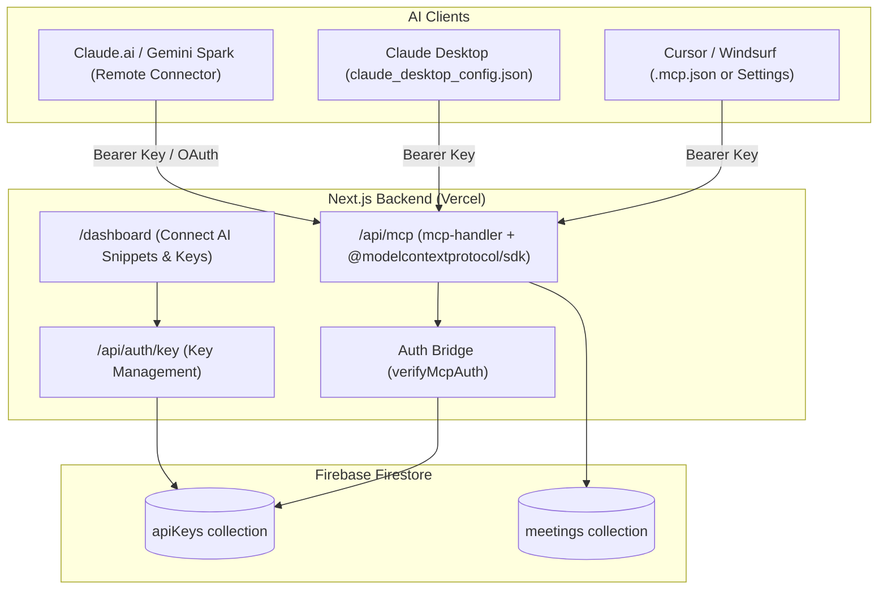

# Embrace AI - Remote MCP Server Design Specification

## 1. Overview
The goal is to expose a Model Context Protocol (MCP) server endpoint directly within the Next.js App Router backend (`backend/src/app/api/mcp/route.ts`). This allows external AI assistants (Cursor, Antigravity, Claude Desktop, Claude.ai Web Connectors, and Gemini Spark) to query meeting recordings, transcripts, summaries, and action items securely over HTTP / SSE.

## 2. Architecture & Components



## 3. Data Flow & Authentication

1. **Authentication Sources**:
   - **User API Key**: Teammate generates a persistent key `embrace_live_<random>` via the dashboard. Stored in Firestore `apiKeys/{apiKey}`:
     ```typescript
     {
       userId: string;
       createdAt: string;
       name: string;
       revoked: boolean;
     }
     ```
   - **Firebase ID Token**: Direct Bearer token from Firebase Auth (`user.getIdToken()`) verified via `firebase-admin` (useful for direct web/extension calls).

2. **Incoming MCP Request Verification**:
   - `withMcpAuth` in `mcp-handler` extracts the `Authorization: Bearer <token>` or `x-api-key` header.
   - Resolves the `userId`. If invalid or revoked, returns `401 Unauthorized`.
   - Passes `{ userId }` into the MCP tool execution context (`authContext`).

3. **Data Isolation**:
   - Every tool query executes against Firestore filtered by `where('userId', '==', authContext.userId)`. Teammates can never access each other's meetings.

## 4. MCP Tools Specification

### Tool 1: `list_meetings`
- **Description**: List recent recorded meetings with metadata.
- **Input Schema (Zod)**:
  ```typescript
  z.object({
    limit: z.number().min(1).max(50).default(10).describe("Number of recent meetings to retrieve")
  })
  ```
- **Output**: Array of meeting objects: `{ id, title, startTime, durationSeconds, audioUrl, createdAt, summary }`.

### Tool 2: `get_meeting_transcript`
- **Description**: Retrieve the full speaker-diarized transcript, executive summary, action items, and audio streaming URL for a specific meeting.
- **Input Schema (Zod)**:
  ```typescript
  z.object({
    meetingId: z.string().describe("The unique ID of the meeting")
  })
  ```
- **Output**: Detailed meeting object including full `transcript.segments`, `transcript.summary`, `transcript.actionItems`, and `audioUrl`.

### Tool 3: `search_meetings`
- **Description**: Search across past meeting titles, summaries, and dialogue transcripts for specific keywords or topics.
- **Input Schema (Zod)**:
  ```typescript
  z.object({
    query: z.string().describe("Search term or keyword (e.g., 'budget', 'roadmap', 'deployment')"),
    limit: z.number().min(1).max(20).default(10).describe("Maximum results to return")
  })
  ```
- **Output**: Matching meetings with highlighted excerpts from transcript segments and summaries.

### Tool 4: `get_action_items`
- **Description**: Aggregate and list pending action items across recent meetings.
- **Input Schema (Zod)**:
  ```typescript
  z.object({
    limitMeetings: z.number().min(1).max(20).default(10).describe("Number of recent meetings to scan for action items")
  })
  ```
- **Output**: Structured list of action items grouped by meeting title and date.

## 5. File Changes & Structure

1. **`backend/package.json`**:
   - Add dependencies: `mcp-handler`, `@modelcontextprotocol/sdk`, `zod`.
2. **`backend/src/lib/mcp-auth.ts`**:
   - `verifyMcpAuth(authHeader: string | null): Promise<{ userId: string }>`
   - `generateUserApiKey(userId: string, name?: string): Promise<string>`
3. **`backend/src/app/api/auth/key/route.ts`**:
   - `GET`: Retrieve existing API key(s) for the logged-in user.
   - `POST`: Generate a new API key for the logged-in user.
   - `DELETE`: Revoke an existing API key.
4. **`backend/src/app/api/mcp/route.ts`**:
   - Implements `createMcpHandler` and registers the 4 tools.
   - Wrapped with `withMcpAuth`.
5. **`backend/src/app/dashboard/page.tsx` & Extension "Connect AI" UI**:
   - Displays the user's API Key and 1-click copy configs for:
     - **Cursor / Windsurf** (`.mcp.json` or Settings)
     - **Claude Desktop** (`claude_desktop_config.json`)
     - **Antigravity** (`mcp_config.json`)
     - **Claude.ai / Gemini Spark** (Connector URL + Token)

## 6. Verification Plan

1. **Automated / Unit Testing**:
   - Test key generation & lookup in Firestore.
   - Test `mcp-auth` validation for valid key, invalid key, and revoked key.
2. **MCP Tool Verification**:
   - Run local MCP client inspection via `npx @modelcontextprotocol/inspector` or curl JSON-RPC requests against `http://localhost:3000/api/mcp`.
   - Verify `list_meetings`, `get_meeting_transcript`, `search_meetings`, and `get_action_items` return proper JSON responses scoped to the test user.
3. **End-to-End Client Connection**:
   - Connect via Antigravity `mcp_config.json` and Cursor settings to verify live query responses.
